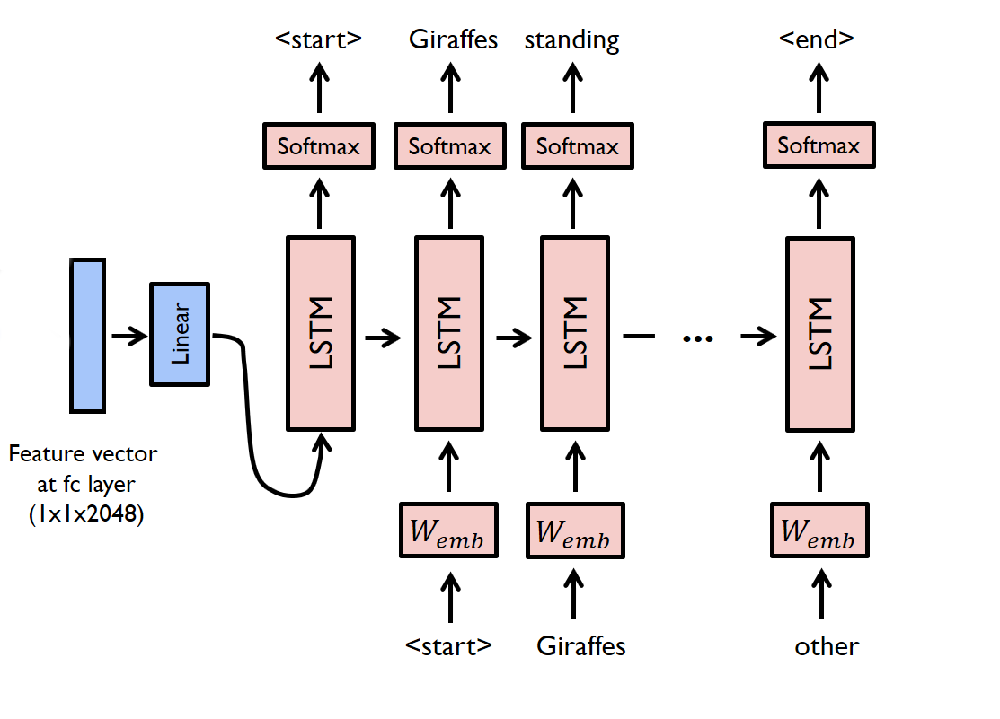

# Topic2Document
The goal of topic to document is to convert a given input bag of words vector into a natural language virtual document. The decoder framework that is widely used in image captioning task is used. The topic keywords are encoded in a bag-of-words vector. The decoder is a long short-term memory (LSTM) network.

#### Training phase
For the encoder part, we convert the identified topic keywords into a bag-of-words vector. The vector is the input dimension of the LSTM network. For the decoder part, source and target texts are predefined. For example, if the document is **"Giraffes standing next to each other"**, the source sequence is a list containing **['\<start\>', 'Giraffes', 'standing', 'next', 'to', 'each', 'other']** and the target sequence is a list containing **['Giraffes', 'standing', 'next', 'to', 'each', 'other', '\<end\>']**. Using these source and target sequences and the bag-of-words vector, the LSTM decoder is trained as a language model conditioned on the vector.

#### Test phase
In the test phase, the encoder part is almost same as the training phase. For the decoder part, there is a significant difference between the training phase and the test phase. In the test phase, the LSTM decoder can't see the image description. To deal with this problem, the LSTM decoder feeds back the previosly generated word to the next input. This can be implemented using a [for-loop](https://github.com/yunjey/pytorch-tutorial/blob/master/tutorials/03-advanced/image_captioning/model.py#L48).
